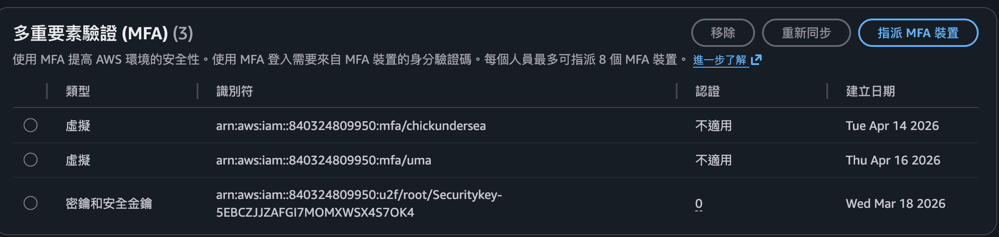

# 【問答題】
##  root user 跟 iam user 的差別？  
root user -> 用來建立 AWS 帳戶時的主帳號，擁有 AWS 帳戶的所有權限
IAM user -> 由 Root User 建立，用於分配個別帳號不同權限

## user, group, role, policy 彼此間的關係為何？policy 的格式為何？  

user：可以是一個人或應用程式，會擁有一組登入用的帳密各別管理
group：多個 user 的集合，用來分類管理權限，例如部門或專案區分

role：代表一個身份或服務，不需要登入，可以指定權限，例如指定S3可以訪問哪些資源

policy：JSON格式定義具體規範誰能做什麼事在什麼資源上

# 【實作題】
## 1. 為 root account 創建 MFA 登入。

## 2. 創建 aws credential（access key & secret），並且使用 aws cli 嘗試存取 ec2 列表（可以手動創建一台機器）及 s3 列表。

  
S3 Bucket

  
  
EC2

  

## 3. 創建一個 user，名為 `s3_readonly`，並且僅給予其 s3 readonly 的權限，為此 user 創建 credential （憑證） 並且設定在 aws cli 內，使用不同的 profile 可以指定用哪個 credential 跟 aws 溝通，驗證方式為嘗試取得 ec2 及 s3 的列表，其中一個會失敗。

  
列出 S3 Bucket 清單

   
  
列出 ec2 清單 Fail 

  

## 4. 嘗試創建 inline policy，使 s3_readonly 這個使用者在某個時間後就無法存取 s3，並且回答 inline policy 可以用在哪些地方。
**Inline Policy 是「直接綁在某一個 IAM 身分上的專屬 Policy」，不能重複使用也不能被數個使用者共用(但是可以綁在Group，底下的User會間接受影響)。**

  
建立一個 inline policy 

  
  
限制時間至 4/30 的 16:00 

  

  
 inline policy 可以用在 IAM中的 User、Group、Role

## 5. 嘗試創建 EC2，並且為其創建一個 S3ReadOnlyRole 的 role，使 ec2 上可以使用 aws cli（或是 sdk） 存取 s3 資源，並且不需要設定 access key。（這題可以用 aws linux，因為他有內建 aws cli）

  
 ssh 至 EC2 

  
  
 不須 access key 讀取s3 list 

  

