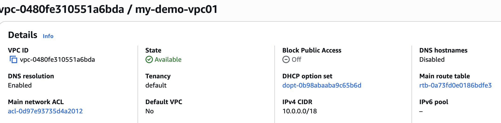
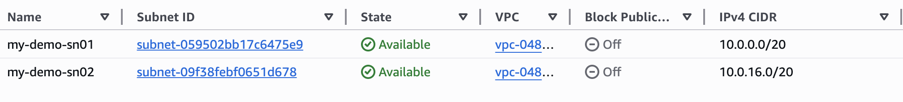
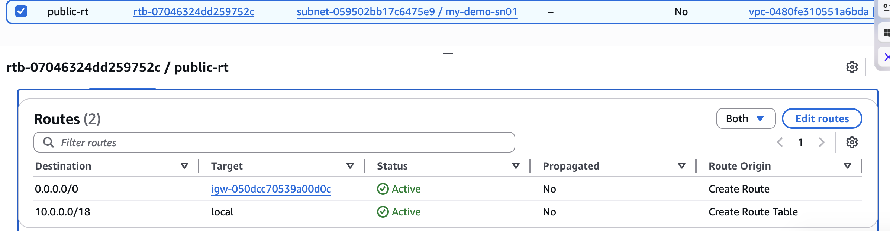
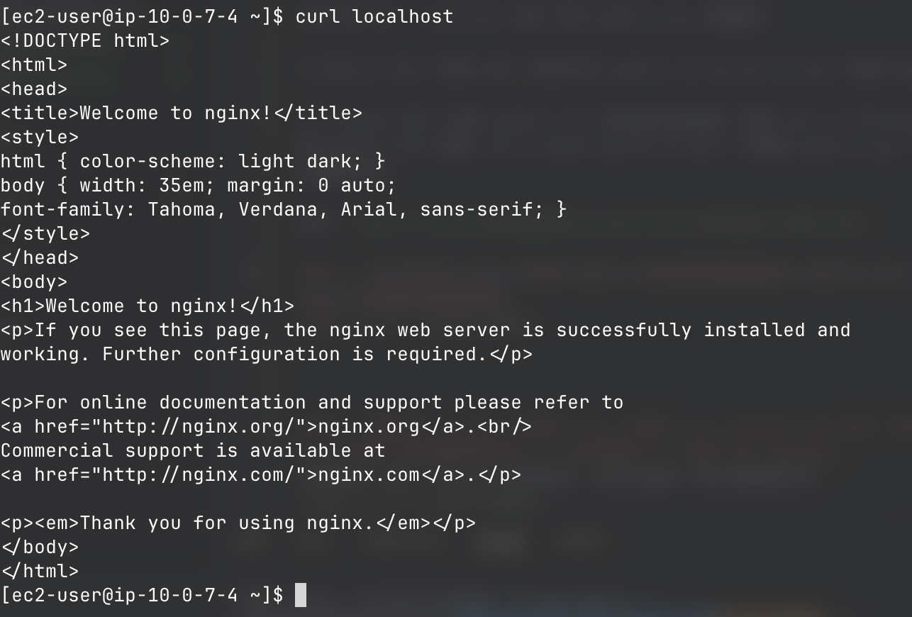
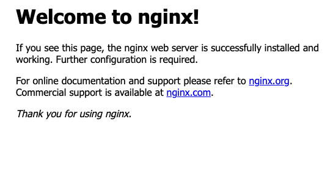
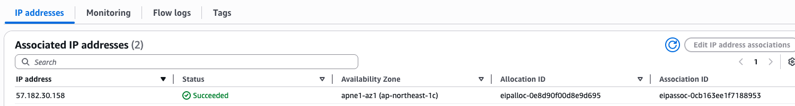

## 嘗試了解 VPC 最基本元件。

- VPC : 一種虛擬的網路區域。 會將資源放入區域內做管理。 
- Region：AWS 的地理區域，每個 region 互相獨立。
- Avaliable Zones(az)：region 內互相隔離的資料中心區域，提供高可用性。
- Subnet： 更小單位的虛擬的網路區域，劃分於 az 內。
- Route Table：定義 subnet 流量轉送規則的路由表（決定public or privite）。
- Internet Gateway：讓 VPC 與網際網路雙向通訊的閘道。
- Nat Gateway：讓 private subnet 對外連線但不被外部連入的閘道。

## 【實作題】
### 1. 在東京 region，嘗試創建一個 VPC，其 CIDR 為 10.0.0.0/18，為其創建兩個 subnet 並且其遮罩長度為 20，並且位於不同的 zone，且提供該兩個 subnet 的 CIDR。

### 2. 承第一題，為該兩個 subnet 分別創建一個 route table，使其成為 public 跟 private subnet。

### 3. 承第二題，在兩個 subnet 上分別創建一台 ec2，並且使用 ssh 從自己的 laptop 連上此兩台 ec2，提供你的做法。

1.先在兩台EC2 各建立 security group ， public 允許 HTTP Anywhere 跟 SSH My IP ， privite 允許 SSH public-sg (當跳板) 

2.Public EC2：直接 SSH，因為它有 public IP 且 SG 22 port 開給 My IP。

3.Private EC2：沒有 public IP，無法從外部直連。改用 ssh -J（ProxyJump）透過 public EC2 跳板，且 private-sg 的 22 port 只開給 public-sg，確保只有跳板機能存取。

指令：`ssh -J ec2-user@<public-ip> ec2-user@<private-ip>`

### 4. 在 public ec2 上安裝 nginx，並且使用瀏覽器輸入 public ip，取得 nginx 的網頁頁面後截圖。

### 5. 嘗試在 private 的那台 ec2 上使用 curl google.com 指令，取得回傳的 html 頁面（有回傳就是成功）=> 如何做到？=> 使用 nat gateway
<!-- 特別警告：NAT Gateway 費用較高，如果有創建，要記得刪除乾淨。 -->

1.建立NAT Gateway並綁定 EIP 

2.在route table設定裡加入 NAT Gateway

3.成功連上外網
